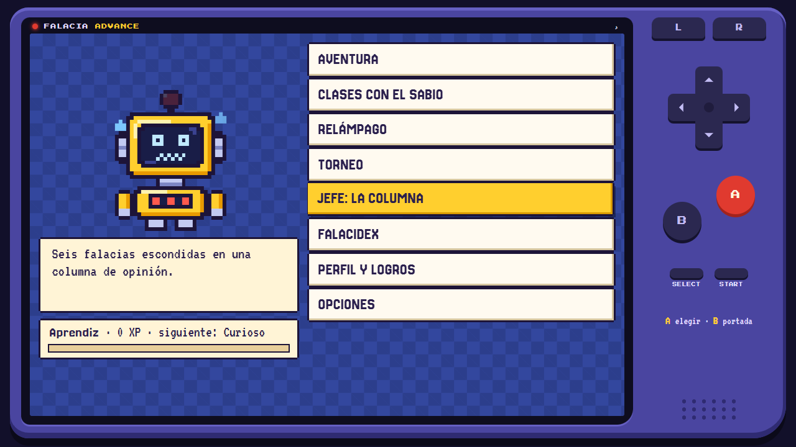
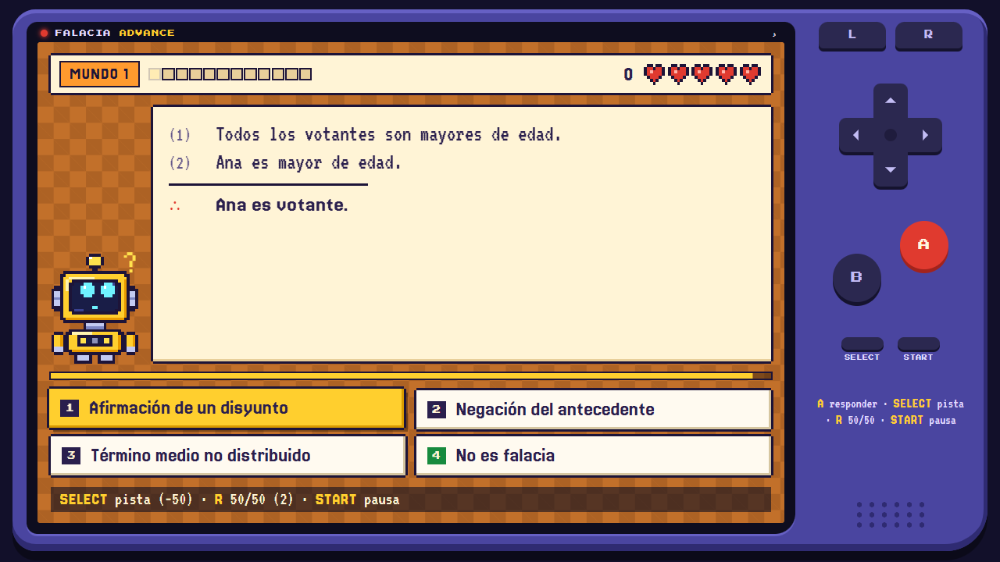

# Falacia Advance

Juego para aprender a detectar falacias, con aspecto de consola portátil. Está basado en un curso breve de lógica y argumentación: «Falacias: cómo fallan los argumentos».

**Jugar:** https://ontoterrorist.github.io/falacia-advance/

## Qué trae

| Modo | Qué es |
|---|---|
| Aventura | Cuatro mundos, cada uno con una mini-clase y 12 desafíos: formales, relevancia, ambigüedad y presunción, causalidad y sesgos |
| Clases con el sabio | Los conceptos clave (argumento, validez, solidez) y las 40 falacias, explicados página por página |
| Relámpago | 60 segundos para decidir si cada argumento es una falacia o es legítimo |
| Torneo | 15 preguntas mezcladas y solo 3 vidas |
| Jefe | Una columna de opinión que esconde seis falacias |
| Falacidex | El álbum de las falacias que ya capturaste |

Cada respuesta explica por qué falla el argumento y cuál es su «primo legítimo»: el caso en que el mismo movimiento sí vale. Uno de cada cinco argumentos no es una falacia, y hay que saber decirlo.

SILO, el robot, acompaña la partida con trece emociones. Hay rangos, logros, música chiptune distinta en cada sección y dos ayudas: la pista y el 50/50.

## Controles

Con el mando en pantalla (o tocando las opciones) y también con teclado: flechas para mover, **Z** o **Intro** para A, **X** o **Esc** para B, **A** y **S** para L y R, **Retroceso** para SELECT (pista), **P** para START (pausa), **1** a **4** para responder y **M** para silenciar.

## Instalarla en el celular

Abre la página en el navegador del teléfono y añádela a la pantalla de inicio:

- **Android (Chrome):** menú ⋮ → «Instalar aplicación» o «Añadir a pantalla de inicio».
- **iPhone (Safari):** botón Compartir → «Añadir a pantalla de inicio».

Después de abrirla una vez funciona sin conexión. El progreso se guarda en el propio teléfono.

## Qué hay en este repositorio

Solo la app ya construida: `index.html` (el juego completo en un archivo, con las fuentes dentro), `manifest.webmanifest`, `sw.js` (para el uso sin conexión) y los iconos.
